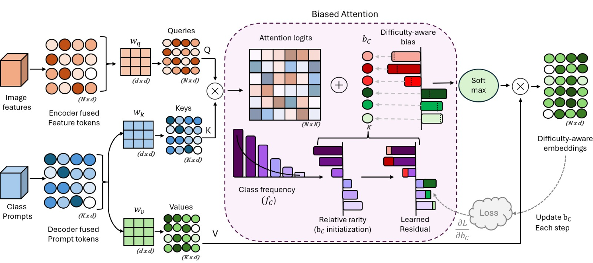

# DFA-Imbalance

🚧 Code will be updated soon.

Official implementation of  
**Learning Class Difficulty via Dynamic Focal Attention for Imbalanced Pathology Segmentation**

## DFA Overview

*Figure 1: Dynamic Focal Attention (DFA) overview.*
