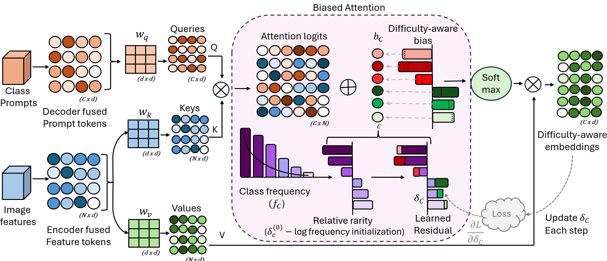

# Dynamic Focal Attention (DFA)

**Paper:** *Learning Class Difficulty in Imbalanced Histopathology Segmentation via Dynamic Focal Attention*  

**Status:** Accepted to **MICCAI 2026**

**arXiv:** [arxiv](https://arxiv.org/abs/2604.13479)

<p align="center">
  
</p>

<p align="center">
  <b>Overview of Dynamic Focal Attention (DFA).</b>
</p>

Dynamic Focal Attention introduces a learnable class-difficulty bias into the attention mechanism to improve segmentation performance under severe class imbalance. The bias is initialized from class rarity and updated during training, allowing the model to dynamically emphasize difficult and underrepresented tissue classes.


## Installation

The environment is the same as [SAM-Path](https://github.com/cvlab-stonybrook/SAMPath).

```bash
# 1) create the environment
conda create -n dfa python=3.10 -y
conda activate dfa

# 2) install PyTorch (pick the build matching your CUDA version)
#    see https://pytorch.org/get-started/locally/
pip install torch torchvision

# 3) install the remaining dependencies
pip install -r requirements.txt
```

> **Do not** `pip install segment-anything` — this repo vendors a **modified** copy of SAM in
> `segment_anything/`. Installing the upstream package would shadow the DFA changes.

Some packages need system libraries: `pyvips` needs **libvips**, `jpeg4py` needs
**libturbojpeg**, and `openslide-python` needs the **OpenSlide** C library. On Ubuntu:

```bash
sudo apt-get install libvips libturbojpeg openslide-tools
```

---

## Pretrained encoder weights

DFA uses the **exact same frozen encoders as SAM-Path**: SAM ViT-B and HIPT ViT-256.
Download them and place them in `checkpoints/`:

| file | encoder | source |
|------|---------|--------|
| `sam_vit_b_01ec64.pth`  | SAM ViT-B | https://github.com/facebookresearch/segment-anything#model-checkpoints |
| `vit256_small_dino.pth` | HIPT      | https://github.com/mahmoodlab/HIPT#pre-reqs--installation |

```
checkpoints/
├── sam_vit_b_01ec64.pth
└── vit256_small_dino.pth
```

You also need to vendor the HIPT backbone source into `network/hipt/`
(see [`network/hipt/README.md`](network/hipt/README.md)).

---

## Data preparation

Data is organized exactly as in SAM-Path. A `dataset_root` directory contains two
sub-directories, `img/` and `mask/`, with all images and masks placed directly inside them:

```
<dataset_root>/
├── img/      # input RGB patches (e.g. .png)
└── mask/     # integer label masks (label 0 = unlabeled / outside ROI)
```

Train / val / test assignment is given by a CSV in `dataset_cfg/` with two columns:

| column   | meaning                                                   |
|----------|-----------------------------------------------------------|
| `img_id` | image filename **without** extension                      |
| `fold`   | integer fold; `-1` = test, `0` = validation, `1–4` = train |

The preprocessed public datasets and the official split CSVs are available from the SAM-Path
release: https://drive.google.com/drive/folders/1BUPZz3nB52J5zRs1ZcEvNK03zw18BeLN

> The CSVs committed here contain only a header row — populate them with your own splits or
> drop in the SAM-Path CSVs. See [`dataset_cfg/README.md`](dataset_cfg/README.md).

---

## Configuration

Each dataset has a config module in `configs/`. **Before running, edit the paths** at the top
of the config you intend to use:

- `model.checkpoint`        → `./checkpoints/sam_vit_b_01ec64.pth`
- `model.extra_checkpoint`  → `./checkpoints/vit256_small_dino.pth`
- `dataset.dataset_root`    → your `dataset_root` (containing `img/` and `mask/`)
- `dataset.dataset_csv_path`→ `./dataset_cfg/<NAME>_cv.csv`
- `out_dir`                 → where checkpoints / logs are written

Key DFA knobs (in `focal_attention` / `loss`):

| key | meaning |
|-----|---------|
| `focal_attention.enabled` | turn DFA on/off |
| `focal_attention.delta_init_scale` | warm-start strength (`0.0` = cold start) |
| `focal_attention.use_prior_in_forward` | `False` → `b_c = δ_c` (DFA); `True` → `b_c = log(π_c) + δ_c` (anchored ablation) |
| `focal_attention.gamma` | `γ` in the warm-start prior `log(π_c)=γ·log(1−f_c)` |
| `loss.delta_lr_multiplier` | dedicated learning-rate multiplier for `δ_c` |
| `loss.bias_l2_lambda` | L2 penalty on `δ_c` (set to `0.0`) |

---

## Training

`main_save_best.py` is the training/validation entry point.

```
usage: main_save_best.py [--config CONFIG_MODULE] [--devices GPU_IDS]
                         [--project PROJECT_NAME] [--name RUN_NAME]
```

The `--config` value is a Python module path (dotted, no `.py` extension), e.g.
`configs.BCSS_DFA`.

```bash
# BCSS (public)
python main_save_best.py --config configs.BCSS_DFA --devices 0 --project DFA --name bcss_dfa_run0

# CRAG (public)
python main_save_best.py --config configs.CRAG_DFA --devices 0 --project DFA --name crag_dfa_run0

# BDSA (private)
python main_save_best.py --config configs.BDSA_DFA --devices 0 --project DFA --name bdsa_dfa_run0
```

Multi-GPU: pass a comma-separated list, e.g. `--devices 0,1,2,3`.

A SLURM launcher template is provided in [`scripts/run_train.sh`](scripts/run_train.sh).
Authenticate Weights & Biases with `wandb login` (or `export WANDB_API_KEY=...`) before
training; **never commit your API key**.

---

## Prediction / inference

`predict.py` writes predicted masks for a directory of images.

```
usage: predict.py [--config CONFIG_MODULE] [--devices GPU_ID]
                  [--pretrained PATH_TO_CHECKPOINT]
                  [--input_dir IMAGE_DIR] [--data_ext IMAGE_EXT]
                  [--output_dir OUTPUT_DIR]
```

```bash
python predict.py --config configs.BCSS_DFA \
    --input_dir /path/to/images --data_ext .png \
    --output_dir /path/to/output \
    --pretrained ./outputs/BCSS_DFA/<run_id>/checkpoints/last.ckpt \
    --devices 0
```

> Label `0` is always the unlabeled region. If your dataset has no unlabeled region, subtract
> `1` from every predicted mask.

---

## Whole-slide-image (WSI) inference

The `DFA_inference/` pipeline tiles a WSI, runs the trained model patch-by-patch, and stitches
the predictions back into a full-slide segmentation:

1. `patch_extraction.py` — tile a WSI into patches.
2. `run_all_wsis_batch.sh` — batch driver over a list of slides in `wsi_config.txt`.
3. `WSI_patch_stitching.py` — stitch patch predictions into a slide-level mask.
4. `visualization_stitched_WSI.py` — render overlays.
5. `generate_runtime_report.py` — summarize runtime.

Edit `DFA_inference/wsi_config.txt` (one `id|path` per slide) and the path/checkpoint
variables at the top of `run_all_wsis_batch.sh` for your environment.

---

## Datasets

| dataset | type | classes | notes |
|---------|------|---------|-------|
| **BCSS** | public | 6 (0 = ignored) | Breast-cancer semantic segmentation |
| **CRAG** | public | gland segmentation | Colorectal adenocarcinoma glands |
| **BDSA** | **private** | 6 (0 = ignored) | 10 WSIs, ~82k 1024² patches; held out at the slide level |

We follow the SAM-Path protocol: one fixed train/val/test split per dataset (no
cross-validation), with 20% of the training data held out for validation. BDSA is private and
is **not** distributed with this repository.

---

## Acknowledgements

This work builds directly on:

- **SAM** — Segment Anything, Meta AI ([repo](https://github.com/facebookresearch/segment-anything))
- **SAM-Path** — Zhang et al., MedAGI 2023 ([repo](https://github.com/cvlab-stonybrook/SAMPath), [paper](https://link.springer.com/chapter/10.1007/978-3-031-47401-9_16))
- **HIPT** — Chen et al., CVPR 2022 ([repo](https://github.com/mahmoodlab/HIPT))

See [`NOTICE`](NOTICE) for full attribution. The DFA contribution is original to this repo.

---

## Citation

If you use this code, please cite our paper (DFA) **and** SAM-Path:

```bibtex
@article{kumari2026dynamic,
  title         = {Learning Class Difficulty in Imbalanced Histopathology Segmentation via Dynamic Focal Attention},
  author        = {Kumari, Lakmali Nadeesha and Cheung, Sen-Ching Samson},
  journal       = {arXiv preprint arXiv:2604.13479},
  year          = {2026},
  doi           = {10.48550/arXiv.2604.13479},
  eprint        = {2604.13479},
  archivePrefix = {arXiv},
  primaryClass  = {eess.IV}
}
```

---

*Released under the Apache License 2.0. Code released upon paper acceptance.*
